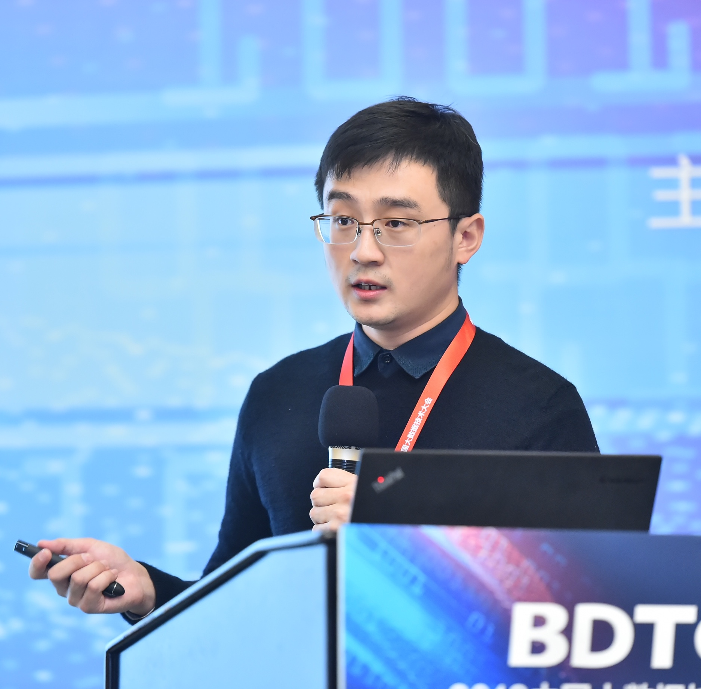

[Xiamen University](http://www.xmu.edu.cn/), China.

## About Me

I am currently a final year Ph.D student in computer science at [Xiamen University](http://www.xmu.edu.cn/). My mentor is Prof. Rongrong Ji. My research interests are in machine learning and computer vision, especially in hashing-based machine learning, Riemannian-based machine learning, and adversarial deep learning.

## Publications

### Journal:
- Mingbao Lin, Rongrong Ji, **Hong Liu**, Xiaoshuai Sun, Shen Chen, Qi Tian. [Hadamard Matrix Guided Online Hashing](http://link.springer.com/article/10.1007/s11263-020-01332-z). International Journal of Computer Vision, 2020. [[CODES](https://github.com/lmbxmu/mycode/tree/master/2020IJCV_HMOH)]
- **Hong Liu**, Rongrong Ji, Jingdong Wang, and Chunhua Shen. [Ordinal Constraint Binary Coding for Approximate Nearest Neighbor Search](http://ieeexplore.ieee.org/document/8326558/). IEEE Trans. on Pattern Analysis and Machine Intelligence. Volume: 41, Issue: 4, 2019. 
- Rongrong Ji; **Hong Liu**; Liujuan Cao; Di Liu; Yongjian Wu, and Feiyue Huang. [Towards Optimal Manifold Hashing via Discrete Locally Linear Embedding](http://ieeexplore.ieee.org/abstract/document/8000395/), IEEE Trans. on Image Processing, Volume 26, Issue 11, 2017. [[CODES](https://github.com/LynnHongLiu/DLLH)]
- **Hong Liu**, Aiwen Jiang, Mingwen Wang and Jianyi Wan.[Local Similarity Preserved Hashing Learning via Markov Graph for Efficient Similarity Search.](http://www.sciencedirect.com/science/article/pii/S0925231215001538) Neurocomputing, 159, 2015.

### Conference:
- Jie Li, Rongrong Ji, **Hong Liu**, Jianzhuang Liu, Bineng Zhong, Cheng Deng, Qi Tian. [Projection & Probability-Driven Black-Box Attack](https://arxiv.org/abs/2005.03837). CVPR, 2020.[[CODES](https://github.com/theFool32/PPBA)]
- **Hong Liu**, Rongrong Ji, Jie Li, Baochang Zhang, Yue Gao, Yongjian Wu, Feiyue Huang. [Universal Adversarial Perturbation via Prior Driven Uncertainty Approximation](http://mac.xmu.edu.cn/rrji/papers/Universal%20Adversarial%20Perturbation%20via%20Prior%20D.pdf). ICCV, 2019. (Oral). [[CODES](https://github.com/LynnHongLiu/PDUA)]
- Jie Li, Rongrong Ji, **Hong Liu**, Xiaopeng Hong, Yue Gao, Qi Tian. Universal Perturbation Attack Against Image Retrieval. [V1](https://arxiv.org/abs/1812.00552) and [V2](http://mac.xmu.edu.cn/rrji/papers/Universal%20Adversarial%20Perturbation%20via%20Prior%20D.pdf). ICCV, 2019. [[CODES](https://github.com/theFool32/UAP_retrieval)]
- Huafeng Kuang, Rongrong Ji, **Hong Liu**, Shengchuan Zhang, Xiaoshuai Sun, Feiyue Huang and Baochang Zhang. Multi-modal Multi-layer Fusion Network with Average Binary Center Loss for Face Anti-spoofing. ACM MM, 2019. [[CODES](https://github.com/LynnHongLiu/Face-anti-spoofing)]
- Jie Hu, Rongrong Ji, **Hong Liu**, Shengchuan Zhang, Cheng Deng, Qi Tian. [Towards Visual Feature Translation](https://arxiv.org/abs/1812.00573). CVPR, 2019. [[CODES](https://github.com/hujiecpp/VisualFeatureTranslation)]
- **Hong Liu**, Jie Li, Rongrong Ji, and Yongjian Wu. [Learning Neural Bag-of-Matrix-Summarization with Riemannian Network](https://aaai.org/ojs/index.php/AAAI/article/view/4899/4772). AAAI, 2019. [[CODES](https://github.com/theFool32/BoMS)]
- Mingbao Lin, Rongrong Ji, **Hong Liu**, Xiaoshuai Sun, Yongjian Wu, and Yunsheng Wu. [Towards Optimal Discrete Online Hashing with Balanced Similarity](http://mac.xmu.edu.cn/rrji/papers/Towards%20Optimal%20Discrete%20Online%20Hashing%20with%20Balanced%20Similarity.pdf). AAAI, 2019. [[CODES](https://github.com/lmbxmu/mycode/tree/master/2019AAAI_BSODH)]
- **Hong Liu**, Mingbao Lin, Shengchuan Zhang, Yongjian Wu, Feiyue Huang, and Rongrong Ji. [Dense Auto-Encoder Hashing for Robust Cross-Modality Retrieval](https://dl.acm.org/citation.cfm?id=3240684). ACM MM, 2018. 
- Mingbao Lin, Rongrong Ji, **Hong Liu**, and Yongjian Wu. [Supervised Online Hashing via Hadamard Codebook Learning](https://dl.acm.org/citation.cfm?id=3240519). ACM MM, 2018. (Oral). [[CODES](https://github.com/lmbxmu/mycode/tree/master/2018ACMMM_HCOH)]
- Jianqiang Qian, Xianmin Lin, **Hong Liu**, Youming Deng, and  Rongrong Ji. [Towards Compact Visual Descriptor via Deep Fisher Network with Binary Embedding](https://lynnhongliu.github.io/hliu/icme18.pdf). ICME, 2018. (Oral) 
- **Hong Liu**; Rongrong Ji; Yongjian Wu; Feiyue Huang; Baochang Zhang. [Cross-Modality Binary Code Learning via Fusion Similarity Hashing](http://mac.xmu.edu.cn/pdf/3667.pdf). CVPR, 2017. [[CODES](https://github.com/LynnHongLiu/FSH)]
- **Hong Liu**; Rongrong Ji; Yongjian Wu; Feiyue Huang. [Ordinal Constrained Binary Code Learning for Nearest Neighbor Search](https://aaai.org/ocs/index.php/AAAI/AAAI17/paper/view/14813/14399). AAAI, 2017. (Oral) [[CODES](https://github.com/LynnHongLiu/OCH)]
- **Hong Liu**; Rongrong Ji; Yongjian Wu; Gang Hua. [Supervised Matrix Factorization for Cross-Modality Hashing](http://www.ijcai.org/Proceedings/16/Papers/253.pdf). IJCAI, 2016. [[CODES](https://github.com/LynnHongLiu/SMFH)] [[STATEMENT](http://mac.xmu.edu.cn/pdf/RPub.pdf)]
- **Hong Liu**; Rongrong Ji; Yongjian Wu; Wei Liu. [Towards Optimal Binary Code Learning via Ordinal Embedding](https://www.aaai.org/ocs/index.php/AAAI/AAAI16/paper/view/12177). AAAI, 2016. [[CODES](https://github.com/LynnHongLiu/OEH)]

### Pre-print:
- Xiao Liu, Shengchuan Zhang, **Hong Liu**, Xin Liu, Cheng Deng, Rongrong Ji. [CerfGAN: A Compact, Effective, Robust, and Fast Model for Unsupervised Multi-Domain Image-to-Image Translation](https://arxiv.org/abs/1805.10871). In Arxiv, 2018.

## Working Experiences

- 2015.07 - 2015.09, Research Intern, [Tencent Youtu Lab](https://bestimage.qq.com/).

## Activities

**Journal Reviewer**: IEEE TIP, IEEE TNNLS, IEEE TKDE, IEEE TC, PR, PRL, AIRE, KBS, NEUCOM, TVCJ, PLOS ONE, SIGNAL PROCESS-IMAGE.

**Conference reviewer or PC member**: CVPR'20, ECCV'20, ACM MM'20, AAAI'20, WACV'20, ICCV'19, ACM MM'19, ICMR'18, IEEE-ICBK'18.

## Awards
* **National Scholarships, 2019.**

* **Highligts in ChaLearn Face Anti-spoofing Attack Detection Challenge@CVPR2019.** (Our Team name is MAC-adv-group) ([Link](https://sites.google.com/qq.com/chalearnfacespoofingattackdete/))

* **National Scholarships, 2017.**

* **Highlights in MIREX 2015 Query-by-Humming, 2015.**  ([Link](http://www.music-ir.org/mirex/wiki/2015:MIREX2015_Results))

## Contact

**Institution**: School of Information Science and Engineering, Xiamen University, China

**Address**: Room 701, Administration Building #B, Haiyun Park, Xiamen University, 361005

**E-mail**:  lynnliu.xmu[AT]gmail.com or lynnliu0207[AT]163.com or lynnliu[AT]stu.xmu.edu.cn

## Friends

[Zhun Zhong](http://zhunzhong.site/), [Zhiming Luo](https://sites.google.com/view/zhimingluo), [Hao Ye](https://scholar.google.com/citations?hl=zh-CN&user=IUeasPoAAAAJ&view_op=list_works&sortby=pubdate), [Qingyuan Jiang](http://lamda.nju.edu.cn/jiangqy/), [Shengchuan Zhang](https://scholar.google.com/citations?user=GToqXScAAAAJ&hl=en), [Jie Gui](https://scholar.google.com/citations?hl=en&user=f8oE8NgAAAAJ&view_op=list_works&sortby=pubdate) , [Zheng Wang](https://wangzwhu.github.io/home/)

---

